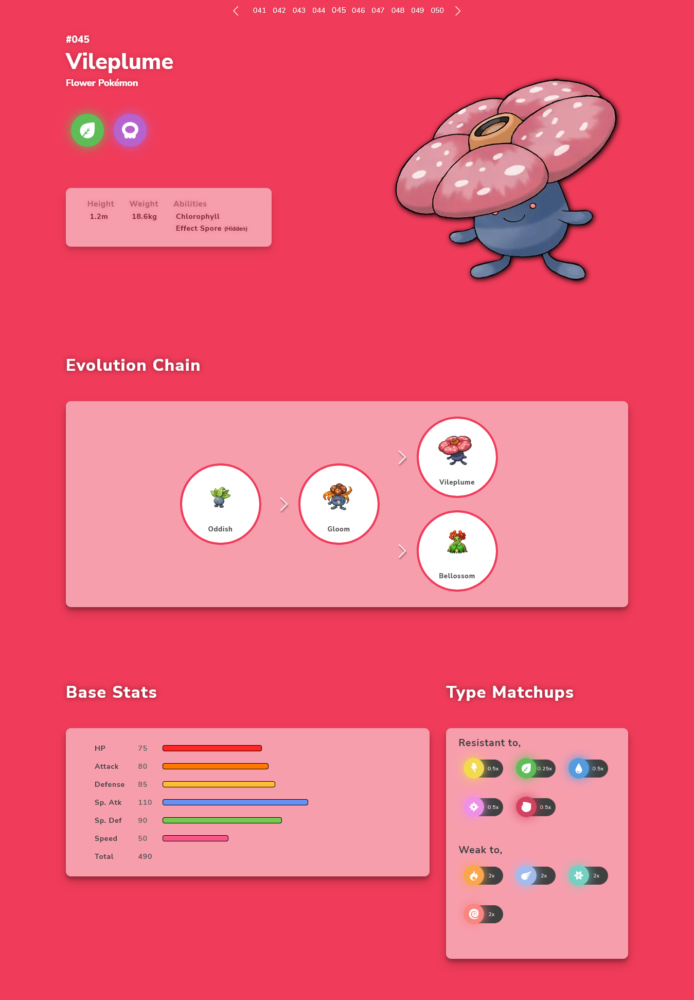
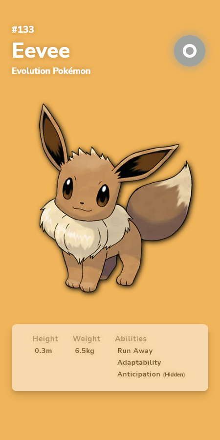

# ToxaDex

A PokéDex App built using Next.js and React. Uses the [PokéAPI](https://pokeapi.co/) directly to fetch data on all 898 Pokémon. Uses Static Site Generation for rendering all the pages.

[Live on Vercel](https://toxadex.netlify.app)

---

## 📃 About

Provides Information on all 898 species of Pokémon including their Genus, Height, Weight, Abilities, Evolution Line, and Stats. Effectiveness against each type is also calculated for every Pokémon in the Type Matchups secion. You can navigate using either the Links in Web Version or by Swiping Left or Right on Touch Devices.

---

## 📷 Screenshots





---

## 💡 Running Locally

```bash
$ git clone https://github.com/Vynex/toxadex

$ cd toxadex
$ npm install

$ npm run dev
```

---
